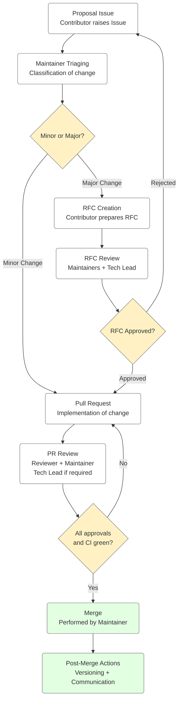

# Developer Guide Change Management Policy

**Classification:** Internal – Engineering Standards  
**Owner:** Pawel Konior  
**Last Updated:** 2025-11-24

---

## 1. Purpose

This document defines the **mandatory process** for initiating, assessing, approving, and implementing changes to the Developer Guide.
The intent is to ensure architectural consistency, regulatory alignment, and controlled evolution of engineering standards across the organization.

This process is binding for all contributors.

---

## 2. Scope

This policy applies to:
- All updates, additions, deletions, or restructuring of Developer Guide content.
- Any modification to coding, testing, architecture, or SDLC standards.
- Any change introducing or modifying `[REQUIRED]`, `[RECOMMENDED]`, or `[OPTIONAL]` rules.
- All RFC submissions.

---

## 3. Change Categories

Every proposed change is classified by Maintainers into one of:

### 3.1 Minor Change
- Typographical corrections
- Clarifications not altering meaning
- Structural improvements with no policy impact

→ Does **not** require RFC  
→ Proceeds directly to PR

### 3.2 Major Change
A change with policy, architectural, compliance, or cross-team impact, including:
- Introduction or modification of a **`[REQUIRED]`** rule
- New development workflow or SDLC guideline
- Architectural or security implications
- Standards affecting multiple teams or repositories

→ **RFC is mandatory**  
→ Requires Maintainer and Tech Lead approval

### 3.3 Rejected Proposal
Maintainers may reject a proposal if:
- Insufficient justification is provided
- Conflict with approved architecture or compliance standards exists
- Risk exceeds acceptable thresholds

---

## 4. Change Management Workflow

This section outlines the authoritative workflow that must be followed for all contributions.



## 5. Step-by-Step Process Description

### Step 1 — Proposal Issue

All changes must begin with a formal Issue, containing:
- Problem statement
- Motivation and justification
- Estimated requirement level (`[REQUIRED]`, `[RECOMMENDED]`, `[OPTIONAL]`)
- Anticipated impact and migration considerations

Incomplete Issues may be declined during triage.

### Step 2 — Maintainer Triaging

Maintainers evaluate the proposal and classify it as:
- **Minor Change** → proceed directly to Pull Request
- **Major Change / Requires RFC** → RFC mandatory
- **Rejected** → Issue closed with written justification

Triaging decisions are authoritative.

### Step 3 — RFC Creation (for Major Changes Only)

If required, the Contributor prepares an RFC document using:

```bash
rfcs/0000-rfc-template.md
```

The RFC must provide:
- Motivation
- Detailed proposal
- Alternatives
- Impact assessment
- Security & compliance considerations
- Migration plan

### Step 4 — RFC Review and Decision

RFCs are reviewed by:
- **Maintainers** (technical and documentation governance)
- **Tech Lead** (approval required for all major changes)

Outcomes:
- **Accepted** → proceed to PR
- **Rejected** → proposal closed

All decisions must be documented.

### Step 5 — Pull Request

Contributor submits a PR implementing the approved change.

Requirements:
- Must reference the Issue (and RFC if applicable)
- Must include requirement level labels
- Must update related documents for consistency
- Must pass pre-commit and CI checks
- Must follow writing and formatting standards

PRs that do not meet these requirements will not be reviewed.

### Step 6 — Review Process

Mandatory approvers:
1. **Reviewer** – subject matter expert
2. **Maintainer** – policy alignment
3. **Tech Lead** – required when:
    - Change introduces `[REQUIRED]` rules
    - Architectural or compliance impact is present
    - RFC was part of the process

PR cannot proceed without approvals and passing CI checks.

### Step 7 — Merge

Maintainers merge the PR using **Squash & Merge** to preserve a clean, auditable commit history.

Only Maintainers may merge.

### Step 8 — Post-Merge Governance

Maintainers perform:
- Versioning or tagging (if applicable)
- Updating release notes or changelog
- Communication to engineering teams
- Coordination with Tech Lead on rollout of new `[REQUIRED]` rules

---

## 6. Escalation

If disagreements arise:
1. Reviewer ↔ Contributor → Maintainer mediates
2. Maintainer ↔ Contributor → escalated to Tech Lead
3. Maintainer ↔ Maintainer → escalated to Tech Lead

Tech Lead decisions are final and must be recorded in the Issue, RFC, or PR.

---

## 7. Compliance Requirements

This policy supports:
- Engineering governance controls
- Regulatory requirements
- Audit traceability
- Security standards
- Architectural alignment

Any deviation from this process must be pre-approved by the Tech Lead and documented.

---

## 8. Contact Information

- **Governance Owner:** Pawel Konior
- **Maintainers:** Listed in `CODEOWNERS`
- **Escalation Authority:** Tech Lead – Developer Standards
