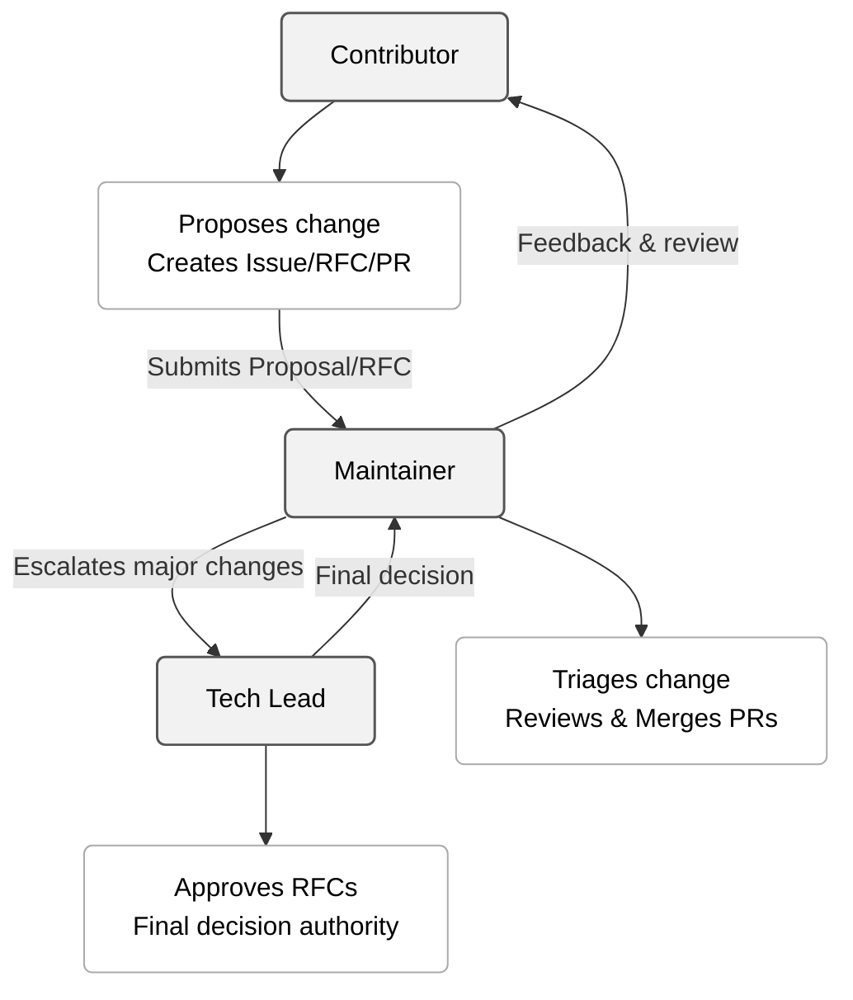

# Roles and Responsibilities
**Classification:** Internal – Engineering Standards  
**Owner:** Pawel Konior
**Last Updated:** 2025-11-24

---

## 1. Purpose

This document defines the official roles, responsibilities, and decision-making authority involved in contributing to and maintaining the Developer Guide.
It establishes a clear governance model ensuring accountability, architectural alignment, regulatory compliance, and traceability across all guideline changes.

The roles described here form the operational and strategic structure for Developer Guide governance.

---

## 2. Role Overview

The Developer Guide governance model contains three primary roles:

1. **Contributor**
2. **Maintainer**
3. **Tech Lead (Principal Engineer)**

Each role is assigned explicit responsibilities and decision rights as defined in the RACI Matrix (Section 4).

---

## 3. Role Definitions

### 3.1 Contributor
**Classification:** Responsible  
**Description:**  
Any engineer proposing modifications to the Developer Guide.

**Primary Responsibilities:**
- Identify improvement opportunities and inconsistencies within the standards.
- Create Proposal Issues initiating the change-management workflow.
- Prepare RFCs when required (major changes, new `[REQUIRED]` rules, architectural or compliance impact).
- Submit Pull Requests aligned with policy and writing standards.
- Address reviewer feedback promptly and professionally.
- Ensure that proposals do not conflict with existing guidance without clear justification.

**Decision Rights:**
- May recommend changes.
- No approval or merging authority.
- Cannot override Maintainer or Tech Lead decisions.

### 3.2 Maintainer
**Classification:** Responsible + Accountable  
**Description:**  
Senior engineers designated to enforce, review, approve, and merge changes to the Developer Guide.

**Primary Responsibilities:**
- Perform **triaging** of all incoming proposals.
- Classify changes (minor / major / needs-rfc / rejected).
- Ensure standards consistency across documents and domains.
- Review RFCs for technical correctness and alignment.
- Review and approve Pull Requests.
- Merge approved PRs (Squash & Merge).
- Identify compliance or architectural risks and escalate as required.
- Maintain auditability and traceability of decisions.

**Decision Rights:**
- Authority to accept or reject minor changes.
- Authority to require RFC for major changes.
- No authority to approve changes affecting architecture or compliance without Tech Lead approval.
- Cannot override Tech Lead decisions.

### 3.3 Tech Lead (Principal Engineer)
**Classification:** Accountable  
**Description:**  
Technical authority responsible for strategic direction, architectural integrity, and compliance alignment of the Developer Guide.

**Primary Responsibilities:**
- Approve or reject all RFCs.
- Approve any change introducing or modifying **`[REQUIRED]`** rules.
- Approve changes with architectural, SDLC, or compliance impact.
- Serve as final escalation point for disputes.
- Ensure the Developer Guide aligns with enterprise architecture, security standards, and regulatory obligations.
- Maintain the long-term roadmap of engineering standards.

**Decision Rights:**
- Final and binding decision authority.
- May instruct Maintainers to revise, delay, or reject proposals.
- Can mandate emergency updates when required by compliance/security teams.

---

## 4. RACI Matrix

The matrix below defines Responsible, Accountable, Consulted, and Informed parties for each governance activity.

| Activity | Contributor | Maintainer | Tech Lead |
|---------|-------------|------------|-----------|
| Proposing a change (Issue) | **R** | C | I |
| Triaging Proposal Issues | I | **A/R** | I |
| Determining change category (minor/major) | I | **A/R** | I |
| Preparing RFC | **R** | C | I |
| Review of RFC | I | R | **A** |
| Approval of RFC | I | R | **A** |
| Drafting Pull Request | **R** | C | I |
| Reviewing Pull Request | I | **R** | C / **A*** |
| Final Approval of PR | I | **A/R** | **A** if REQUIRED/architectural |
| Merging Pull Request | I | **A/R** | I |
| Enforcing compliance with standards | I | **A/R** | A |
| Conflict resolution | I | R | **A** |
| Exception approval | I | C | **A** |
| Communication of major changes | I | R | **A** |

\* **Tech Lead approval is required for:**
- Any change to `[REQUIRED]` rules
- All architectural, SDLC, or compliance-affecting changes
- Any PR following an accepted RFC

---

## 5. Role Interaction Diagram (Mermaid)

---

## 6. Decision-Making Authority

### 6.1 Contributor Authority Limits

Contributors may suggest changes but:
- Cannot approve any modification
- Cannot merge
- Cannot alter requirement levels
- Cannot override Maintainer or Tech Lead decisions

### 6.2 Maintainer Authority Limits

Maintainers may:
- Approve and merge minor changes
- Require RFCs for major changes
- Block PRs on policy, architecture, or compliance grounds

Maintainers must not:
- Approve changes to `[REQUIRED]` rules without Tech Lead involvement
- Approve RFCs independently
- Introduce new standards without the documented workflow

### 6.3 Tech Lead Authority

The Tech Lead:
- Approves all RFCs
- Approves all `[REQUIRED]` level changes
- Finalizes disputes
- Has ultimate governance authority
- May issue mandatory updates for compliance/security reasons

Tech Lead decisions are final and cannot be overruled.

---

## 7. Compliance and Audit Considerations

All roles must ensure:
- Traceability of all decisions (Issues, PRs, RFCs)
- Adherence to CI-enforced linting and formatting standards
- Consistency with security and regulatory policies
- Proper classification of requirement levels

Improperly reviewed or undocumented changes may constitute an audit finding.

---

## 8. Contact Information

- **Governance Owner:** Architecture & Engineering Excellence Office
- **Maintainers:** Listed in `CODEOWNERS`
- **Escalation Authority:** Tech Lead – Developer Standards