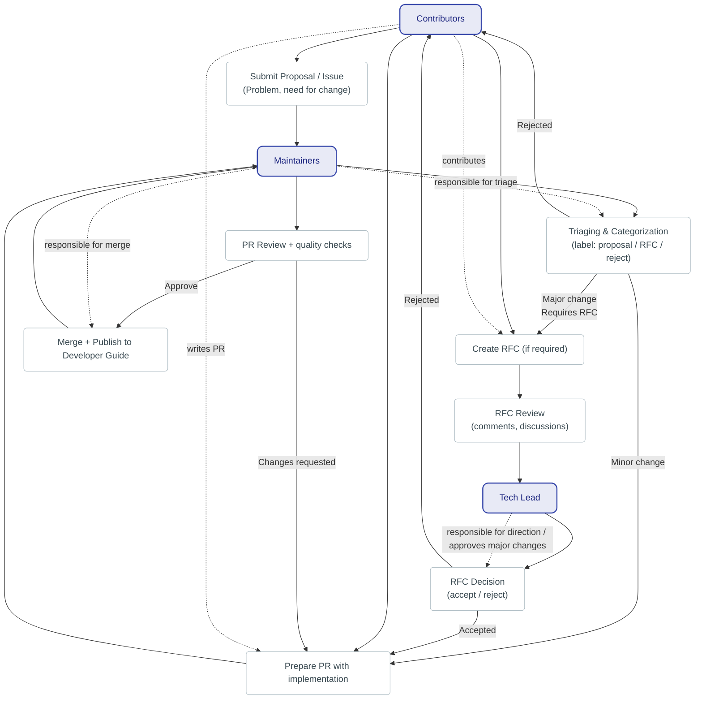

```mermaid
flowchart TD

    %% Styles
    classDef role fill:#e8eaf6,stroke:#3949ab,stroke-width:2px,color:#1a237e,rx:10,ry:10;
    classDef step fill:#ffffff,stroke:#b0bec5,stroke-width:1px,color:#37474f,rx:5,ry:5;
    classDef edgeNote stroke-width:0px,color:#555;

    A[Contributors]:::role
    B[Maintainers]:::role
    C[Tech Lead]:::role

    S1["Submit Proposal / Issue<br>(Problem, need for change)"]:::step
    S2["Triaging & Categorization<br>(label: proposal / RFC / reject)"]:::step
    S3["Create RFC (if required)"]:::step
    S4["RFC Review<br>(comments, discussions)"]:::step
    S5["RFC Decision<br>(accept / reject)"]:::step
    S6["Prepare PR with implementation"]:::step
    S7["PR Review + quality checks"]:::step
    S8["Merge + Publish to Developer Guide"]:::step

    %% Flow
    A --> S1
    S1 --> B
    B --> S2

    %% Decision paths
    S2 -->|Minor change| S6
    S2 -->|Major change<br>Requires RFC| S3
    S2 -->|Rejected| A

    %% RFC path
    A --> S3
    S3 --> S4
    S4 --> C
    C --> S5
    S5 -->|Accepted| S6
    S5 -->|Rejected| A

    %% PR path
    A --> S6
    S6 --> B
    B --> S7
    S7 -->|Approve| S8
    S7 -->|Changes requested| S6

    %% Merge
    S8 --> B

    %% Side notes (implicit RACI)
    A -. contributes .-> S3
    A -. writes PR .-> S6
    B -. responsible for triage .-> S2
    B -. responsible for merge .-> S8
    C -. responsible for direction / approves major changes .-> S5
```