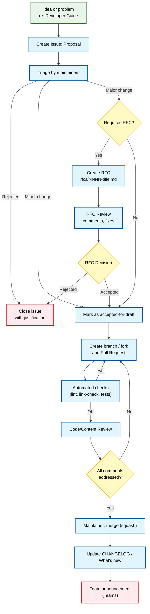

```mermaid
flowchart TD
    %% Styles
    classDef process fill:#e1f5fe,stroke:#01579b,stroke-width:2px,color:black;
    classDef decision fill:#fff9c4,stroke:#fbc02d,stroke-width:2px,color:black;
    classDef terminator fill:#ffebee,stroke:#c62828,stroke-width:2px,color:black;
    classDef start fill:#e8f5e9,stroke:#2e7d32,stroke-width:2px,color:black;

    A[Idea or problem<br/>re: Developer Guide]:::start --> B[Create Issue: Proposal]:::process
    B --> C[Triage by maintainers]:::process
    
    C -->|Rejected| C1[Close issue<br/>with justification]:::terminator
    
    C -->|Minor change| D[Mark as accepted-for-draft]:::process
    C -->|Major change| E{Requires RFC?}:::decision
    
    E -->|Yes| F[Create RFC<br/>rfcs/NNNN-title.md]:::process
    E -->|No| D
    
    F --> G[RFC Review<br/>comments, fixes]:::process
    G --> H{RFC Decision}:::decision
    H -->|Rejected| C1
    H -->|Accepted| D
    
    D --> I[Create branch / fork<br/>and Pull Request]:::process
    I --> J["Automated checks<br/>(lint, link-check, tests)"]:::process
    J -->|Fail| I
    
    J -->|OK| K[Code/Content Review<br/>]:::process
    K --> L{All comments<br/>addressed?}:::decision
    L -->|No| I
    L -->|Yes| M["Maintainer: merge (squash)"]:::process
    
    M --> N[Update CHANGELOG / What's new]:::process
    N --> O["Team announcement<br/>(Teams)"]:::terminator
```