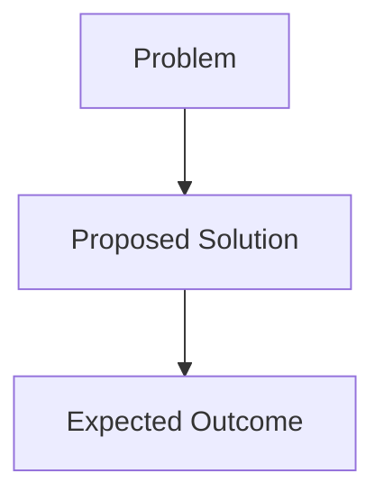

# RFC-0000: <Short Descriptive Title>

## 1. Summary

Provide a concise, high-level summary of the proposal (3–5 sentences).
This section must allow a reader to understand the intent without reading the rest of the document.

Include:
- What is being proposed?
- What problem does it solve?
- Why now?
- Who benefits?

---

## 2. Motivation

Explain **why** this change is required.

Your explanation MUST include:

- The problem or inefficiency with current standards
- Any architecture, security, compliance, or SDLC concerns
- Examples demonstrating inconsistency or risk
- Why this cannot be addressed via a minor change
- Why an RFC is necessary

This section MUST clearly justify the need for the proposal.

---

## 3. Proposal

Describe **exactly** what is being proposed.

Include:

### 3.1 High-Level Proposal
- New rules or modifications
- Requirement level(s) affected:
  - `[REQUIRED]`
  - `[RECOMMENDED]`
  - `[OPTIONAL]`
- New workflows, architectures, or SDLC processes introduced

### 3.2 Detailed Specification
Provide a complete and precise description of the change:

- Technical rules
- Terminology
- Definitions
- Constraints
- Edge cases
- CI/CD enforcement requirement
- Cross-team interactions

### 3.3 Illustrative Examples
If applicable, provide examples:

- Recommended patterns
- Code samples
- Diagrams
- CI/CD configuration snippets

---

## 4. Alternatives Considered

Document all meaningful alternatives, even if they were rejected.

For each alternative:
- **Alternative:**
- **Reason Rejected:**
- **Impact Compared to Proposed Solution:**

This section is critical for governance to ensure all strategic options were evaluated.

---

## 5. Impact Assessment

### 5.1 Architectural Impact
- How will this affect existing architecture baselines?
- Does it mandate new patterns?
- Does it deprecate old ones?

### 5.2 SDLC / CI-CD Impact
- Required changes to pipelines?
- New mandatory checks?
- Effect on testing strategy?

### 5.3 Security Impact
- New security requirements?
- Changes affecting secrets, dependencies, access control, scanning, threat model?

### 5.4 Compliance / Regulatory Impact
Does it impact:

- SOX controls?
- PCI-DSS?
- DORA?
- Internal governance?
- Audit trace requirements?

### 5.5 Operational Impact
- Runtime or deployment changes?
- Maintenance overhead?
- Monitoring/logging updates?

### 5.6 Team / Domain Impact
- Single team?
- Multiple teams?
- Cross-organization?

### 5.7 Backward Compatibility
- Will this break any existing compliant projects?
- Can the change be adopted incrementally?

---

## 6. Migration Plan

If the proposal introduces changes that require migration, describe:

- Phases
- Timelines
- Risks
- Required communication
- Expected engineering effort
- Fallbacks or rollback paths
- Changes to CI/CD templates
- Code examples for adoption

If no migration is required, state:

> This change is fully backward compatible.
> No migration actions are required.

---

## 7. Security & Compliance Considerations

Explain:

- Security implications
- Compliance or regulatory obligations
- How the change aligns with internal policies
- Any residual risk that must be accepted

If none:

> This RFC introduces no new security or compliance concerns.

---

## 8. Unresolved Questions

List open questions or decisions that MUST be finalized before acceptance.

Examples:

- Should this apply to legacy services?
- Should the rule be `[REQUIRED]` or `[RECOMMENDED]`?
- Should CI enforce this change from day one?

---

## 9. Decision Record (Filled After Review)

To be completed by Maintainers and Tech Lead.

- **Maintainer Decision:** Accepted / Rejected / Requires Revision
- **Tech Lead Decision:** Approved / Rejected / Requires Revision
- **Date of Decision:**
- **Notes:**

---

## 10. Appendix

Optional section for:

- Diagrams (Mermaid, C4, sequence)
- Reference architectures
- Code samples
- Comparison tables
- Extended examples
- Supporting evidence / data

Example diagram:

## 11. References

Include links to:
- Related RFCs
- Internal policy documents
- External standards (PEPs, OWASP, ISO, NIST)
- Architecture decision records