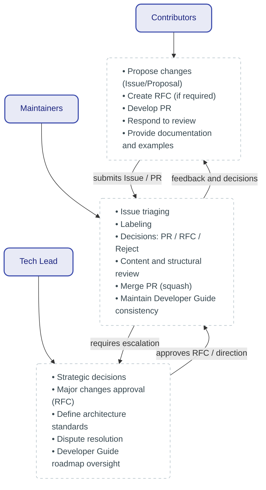

```mermaid
flowchart TD

    %% Style
    classDef role fill:#e8eaf6,stroke:#3949ab,stroke-width:2px,color:#1a237e,rx:10,ry:10;
    classDef action fill:#ffffff,stroke:#b0bec5,stroke-width:1px,color:#37474f,rx:5,ry:5,text-align:left,stroke-dasharray: 5 5;

    %% Roles
    A[Contributors]:::role
    B[Maintainers]:::role
    C[Tech Lead]:::role

    %% Contributors Actions
    A1["• Propose changes (Issue/Proposal)<br>• Create RFC (if required)<br>• Develop PR<br>• Respond to review<br>• Provide documentation and examples"]:::action

    %% Maintainers Actions
    B1["• Issue triaging<br>• Labeling<br>• Decisions: PR / RFC / Reject<br>• Content and structural review<br>• Merge PR (squash)<br>• Maintain Developer Guide consistency"]:::action

    %% Tech Lead Actions
    C1["• Strategic decisions<br>• Major changes approval (RFC)<br>• Define architecture standards<br>• Dispute resolution<br>• Developer Guide roadmap oversight"]:::action

    %% Connections
    A --> A1
    B --> B1
    C --> C1

    %% Cross-role interactions
    A1 -->|submits Issue / PR| B1
    B1 -->|requires escalation| C1
    C1 -->|approves RFC / direction| B1
    B1 -->|feedback and decisions| A1
```